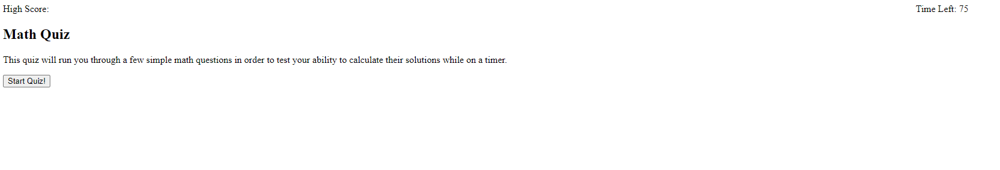

# Lucas-Saaler-Quiz-Game

## Description

This is a quiz that will test your ability to solve simple math problems while on a timer.

## Table of Contents (Optional)

- [Usage](#usage)
- [Credits](#credits)
- [License](#license)

## Usage

When you open the website, you will be greeted by a starting screen. Press the start button to begin the test and the timer. You are given 75 seconds, and there are 5 questions. Whenever you answer a question wrong, you will have 15 seconds subtracted from the timer. When you finish the questions, or if the timer hits 0, you will be prompted to input your initials. When you do that, the leaderboard and high score will be updated. Deployed website can be found here: https://lucas-saaler.github.io/Lucas-Saaler-Quiz-Game/

## Credits

I wrote all this code myself.

## License

